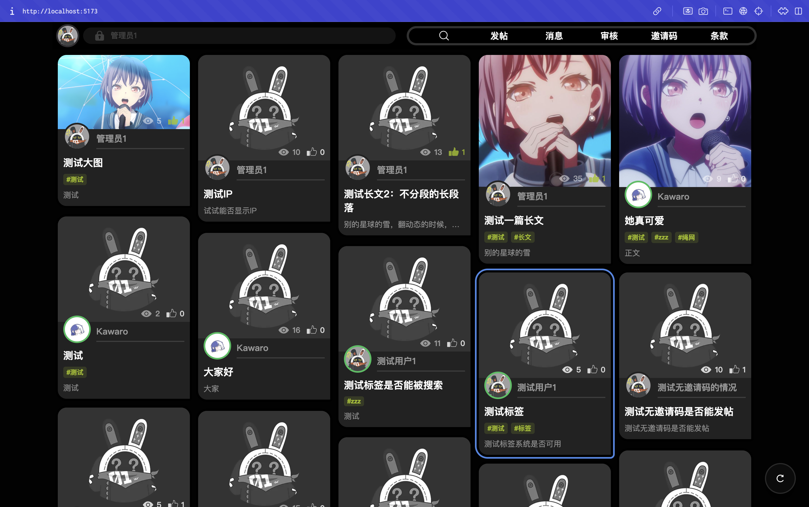
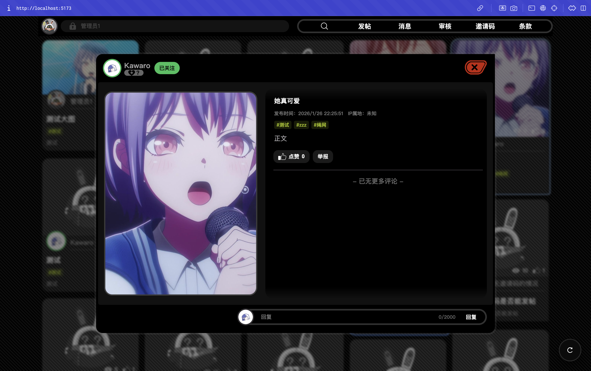
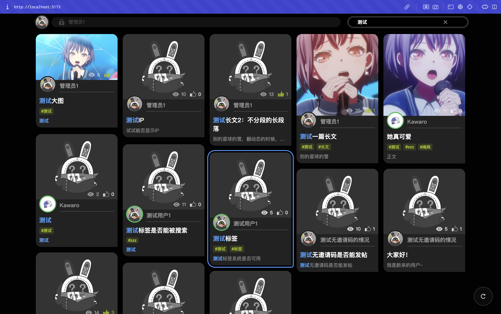
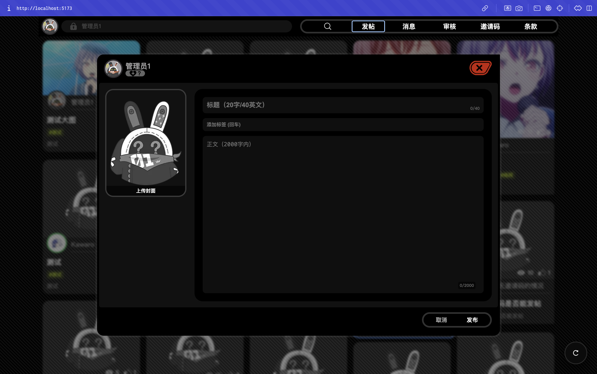

# 绳网风格论坛（Inter-Knot）

这是一个以《绝区零》绳网为灵感的轻量论坛/讨论社区，基于 SvelteKit + PocketBase 构建，尝试还原“线索串联与话题聚合”的社区氛围。

## 截图
| 首页 | 帖子展示 |
| --- | --- |
|  |  |

| 搜索功能 | 发布功能 |
| --- | --- |
|  |  |

## 功能概览
- 瀑布流帖子墙与沉浸式详情页
- 图文发帖、封面图上传与个人发帖记录
- 关键词搜索、点赞、关注与阅读统计
- 评论/回复体系与系统消息中心
- 举报阈值自动隐藏 + 管理员审核队列
- AI 内容审核（默认严格，支持人工复核）
- 邀请码机制、合规声明与使用条款页面
- 管理员工具：审核、邀请码与条款编辑
- API 限流与基础反滥用控制

## 技术栈
- 前端：SvelteKit + TypeScript
- 后端：PocketBase
- API：SvelteKit server routes

## 本地运行（开发）
1. 复制环境变量：`cp webapp/.env.example webapp/.env`
2. 启动 PocketBase：下载 PocketBase 后放到 `server/pocketbase` 并运行 `cd server && ./pocketbase serve --http=0.0.0.0:8090`
3. 打开管理后台创建管理员账号：`http://127.0.0.1:8090/_/`
4. 启动前端：`cd webapp && npm install && npm run dev`

## 环境变量（webapp/.env）
- `PUBLIC_PB_URL`: PocketBase 地址
- `PUBLIC_REPORT_THRESHOLD`: 举报阈值（达到后自动隐藏）
- `PUBLIC_INVITE_REQUIRED`: 是否启用邀请发帖
- `PB_ADMIN_EMAIL` / `PB_ADMIN_PASSWORD`: 集合脚本使用的管理员账号
- `AI_BASE_URL` / `AI_MODEL` / `AI_API_KEY`: AI 审核配置
- `RATE_LIMIT_*`: API 速率限制

## PocketBase 集合结构
- 推荐方式：使用仓库内的 `server/pb_migrations`，PocketBase 启动时会自动执行未应用的迁移。
- 修改集合后：执行 `cd server && ./pocketbase migrate collections` 生成新的迁移文件并提交。
- 备用方式：运行 `cd webapp && node scripts/setup_collections.mjs`，脚本会创建或更新集合结构。
- 可选方式：在 PocketBase 管理后台导出/导入集合结构 JSON（不含数据），用于环境迁移。

## 致谢
- 感谢 [blacktunes/interknot](https://github.com/blacktunes/interknot) 的概念与视觉氛围启发
- 感谢 [share121/inter-knot](https://github.com/share121/inter-knot) 的实现参考与灵感

## 说明
本项目为爱好者非商业作品，与米哈游及《绝区零》官方无关，欢迎反馈与交流。

## 许可证
MIT License
